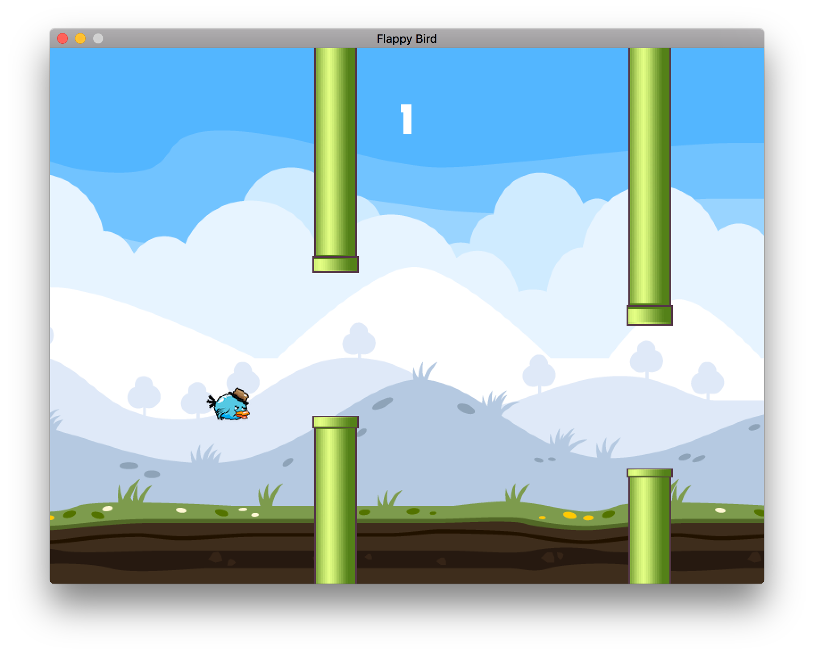

Flappy Bird written in Go
==============================

go-flappybird is the fun project to get into gamedev and get to know how go-sdl2 works.



Requirements
============

* [Golang](https://golang.org)
* [SDL2](http://libsdl.org/download-2.0.php)
* [SDL2_image](http://www.libsdl.org/projects/SDL_image/)
* [SDL2_ttf](http://www.libsdl.org/projects/SDL_ttf/)

On __Mac OS X__, install SDL2 via [Homebrew](http://brew.sh) like so:
`brew install sdl2{,_image,_ttf}`

Installation
============
To get the bindings, type:
```
go get -u github.com/veandco/go-sdl2/sdl
go get -u github.com/veandco/go-sdl2/sdl_mixer
go get -u github.com/veandco/go-sdl2/sdl_image
go get -u github.com/veandco/go-sdl2/sdl_ttf
```


Run
===

To get it run, type:
`go build -o flappybird; ./flappybird`


Credits
=======

* [Bird](http://opengameart.org/content/free-game-asset-grumpy-flappy-bird-sprite-sheets)
